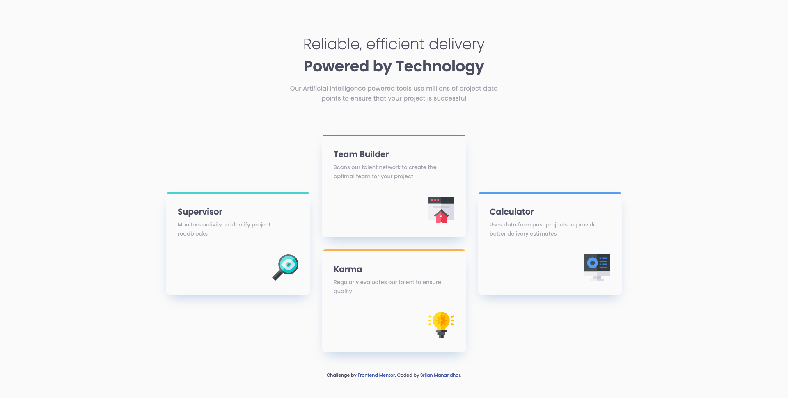

# Frontend Mentor - Four card feature section solution

This is a solution to the [Four card feature section challenge on Frontend Mentor](https://www.frontendmentor.io/challenges/four-card-feature-section-weK1eFYK). Frontend Mentor challenges help you improve your coding skills by building realistic projects.

## Table of contents

- [Overview](#overview)
  - [The challenge](#the-challenge)
  - [Screenshot](#screenshot)
  - [Links](#links)
- [My process](#my-process)
  - [Built with](#built-with)
  - [What I learned](#what-i-learned)
- [Author](#author)

## Overview

### The challenge

Users should be able to:

- View the optimal layout for the site depending on their device's screen size

### Screenshot




### Links

- Solution URL: [https://github.com/srijanss/four-card-feature-section](https://github.com/srijanss/four-card-feature-section)
- Live Site URL: [https://srijanss.github.io/four-card-feature-section/](https://srijanss.github.io/four-card-feature-section/)

## My process

### Built with

- Semantic HTML5 markup
- CSS custom properties
- Flexbox
- CSS Grid
- Mobile-first workflow
- [Vite](https://vitejs.dev/) - Lightweight frontend tooling
- [PostCSS](https://postcss.org/) - Tool to transform CSS using plugins

### What I learned

```html
<h1>Some HTML code I'm proud of</h1>
```

```css
section {
  position: relative;
  display: flex;
  flex-direction: column;
  border-radius: 8px;
  box-shadow: 0 15px 30px -11px var(--shadow-blue);
  padding: 28px;
  overflow: hidden;
  &:before {
    content: "";
    position: absolute;
    top: 0;
    left: 0;
    @mixin full-width;
    height: 4px;
    background-color: var(--hcolor, var(--cyan));
  }
}
```

I had some difficulties to show the top border on each section.

- It was not matching with the design.
- I used border-top, it was rounding as per the border-radius CSS
- Then I used ::before pseudo element to add the top colored bar, now the pseudo element was covering the border-radius
- Then I found out that I have to set "overflow: hidden" to clip the child elements to fit within parent's border radius

```css
@mixin media-query-desktop {
    grid-template-columns: repeat(3, 1fr);
    grid-template-areas:
      "supervisor team-builder calculator"
      "supervisor karma calculator";
    justify-items: center;
    gap: 30px;
    section {
      width: var(--card-width);
      height: var(--card-height);
      &:nth-child(1) {
        grid-area: supervisor;
        align-self: center;
      }
      &:nth-child(2) {
        grid-area: team-builder;
        grid-row: 1;
      }
      &:nth-child(3) {
        grid-area: karma;
      }
      &:nth-child(4) {
        grid-area: calculator;
        align-self: center;
      }
    }
```

I had a chance to learn about CSS Grid in detail, and use grid-template-areas in this project. I also learnt how to use grid-column and grid-row for the same layout. But use of grid-template-areas was clean and easy to understand.

## Author

- Website - [Srijan Manandhar](https://github.com/srijanss)
- Frontend Mentor - [@srijanss](https://www.frontendmentor.io/profile/srijanss)
